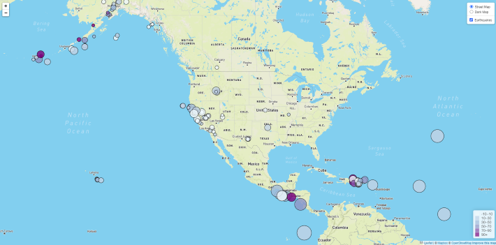

# Visualizing Data with Leaflet

## USGS Earthquake Data

   The USGS provides earthquake data in a number of different formats, updated every 5 minutes. I selected a dataset from the [USGS GeoJSON Feed](http://earthquake.usgs.gov/earthquakes/feed/v1.0/geojson.php) page for earthquakes in the last 7 days of magnitude greater than 2.5 to visualize using Leaflet.

   I created a map using Leaflet that plots all of the earthquakes from that data set based on their longitude and latitude.

   The circular data markers reflect the magnitude of the earthquake by their size, and depth of the earth quake by color. Earthquakes with higher magnitudes appear larger and earthquakes with greater depth appear darker in color.

   The map also includes popups that provide additional information about the earthquake.

   The legend provides a guide to the depth color scheme.

   

